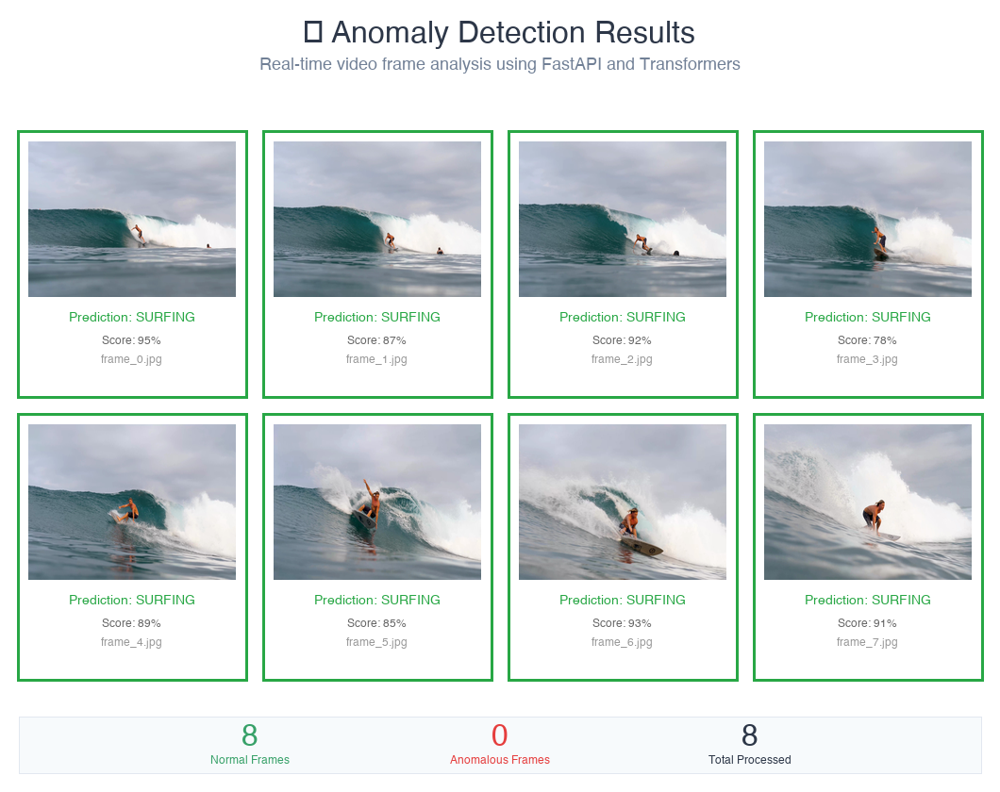

# Anomaly Detection API

## 🚀 Overview
FastAPI-based anomaly detection system for video frames, running completely locally with no cloud dependencies. Originally developed on Azure Databricks, now fully independent for cost-free operation.

## 📊 Prediction Results

### 🎥 Demo Video
🎬 **[Watch Demo Video](https://github.com/ark0723/anomaly_detection/releases/latest/download/demo_video.mp4)** (7.5MB)

*Live demonstration of the Streamlit web interface with drag & drop image upload and real-time anomaly detection results*

> **Note:** Video is hosted in GitHub Releases

### Interactive Demo
🔗 **[View Live Results](https://ark0723.github.io/anomaly_detection/)** (GitHub Pages)

### Jupyter Notebook
📓 **[Interactive Testing Notebook](notebook/07_deployment.ipynb)** - Run this notebook to see live predictions with HTML visualization



*Real-time anomaly detection results showing normal frames (green border) and anomalous frames (red border) with confidence scores.*

## 🛠️ Quick Start

### 1. Setup Environment
```bash
# Create virtual environment
python -m venv .venv
source .venv/bin/activate  # On Windows: .venv\Scripts\activate

# Install dependencies
pip install -r requirements.txt
```

### 2. Download Model (One-time setup)
```bash
# Download model from Databricks to local storage
# This creates models/model/ directory with the MLflow model
python download_model.py
```

### 3. Start API Server
```bash
# Use local model (Databricks-independent)
python api_local.py
```

> **Note:** `api.py` is no longer available as the Azure Databricks workspace has been deleted. Only `api_local.py` works with the downloaded local model.

### 4. Test with Client
```bash
python client.py
```

### 5. Interactive Testing

#### Option A: Jupyter Notebook
Open `notebook/07_deployment.ipynb` for interactive testing with HTML visualization.

#### Option B: Web Interface (Upload Your Own Images) 🆕
```bash
# Install Streamlit (if not already installed)
pip install streamlit

# Start the local API server first
python api_local.py

# In another terminal, run the web interface
streamlit run web_interface.py
```
Then open your browser to `http://localhost:8501` and upload your own images for real-time predictions!

## 📁 Project Structure
```
anomaly_detection/
├── api.py                 # FastAPI server
├── client.py              # API client for testing
├── web_interface.py       # Streamlit web interface for image upload
├── frames/                # Sample images
├── notebook/              # Jupyter notebooks
│   └── 07_deployment.ipynb # Interactive testing & visualization
└── requirements.txt       # Dependencies
```

## 🔧 Features
- **🏠 Fully Local**: No cloud dependencies or costs
- **📤 Base64 Image Processing**: Handles multiple images in batch
- **⚡ Real-time Predictions**: Fast inference with CPU optimization
- **🎨 Visual Results**: Color-coded prediction display
- **🌐 Web Interface**: Drag & drop image upload with Streamlit
- **🛡️ Error Handling**: Comprehensive logging and fallback mechanisms
- **💰 Cost-Free**: Zero ongoing operational costs

## 🎯 API Endpoints
- `GET /`: Health check
- `POST /predict`: Batch image prediction

## 📝 Model Details
- **Framework**: Transformers pipeline via MLflow
- **Input**: Base64-encoded images
- **Output**: Classification scores (normal/anomaly)
- **Deployment**: Local FastAPI (Databricks alternative)
